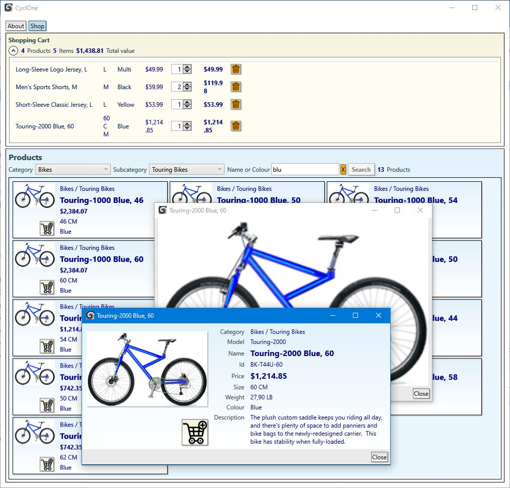

## WpfShop

#### Description
Working desktop application for test and demo purpose based on WPF. It simulates limited shopping capabilities based on the AdventureWorks database.

#### News
* The projects have migrated to .Net 5.
* Currently no installation packages are supplied for the latest code. Refer to the last released versions, which are functionally equal.
* Unity dependency injection has been made use of far more and better.

#### Purpose
* Explore various techniques based on C# and WPF.
* Manage the code by Git and GitHub.
* Explore continuous integration by using combinations of Git, GitHub, TeamCity and Azure DevOps.
* Explore Scrum process management by integration with Jira and Azure DevOps.

#### Notes
* This is a near equivalent of my [PortableShop](https://github.com/a-einstein/PortableShop).
* Submitted to code analysis by [Better Code Hub](https://bettercodehub.com). Current score:   
* Connected to automated Azure Devops build and release pipelines. Current build status for the master branch: 

#### Prerequisites
* The application must be configured for a running instance of my [AdventureWorks services](https://github.com/a-einstein/AdventureWorks/blob/master/README.md).

#### Known issues
* MSIX installing is currently not supplied for the lastest code for technical reasons.
* Click Once installing is not provided for the latest code, because of a [bug in Visual Studio](https://developercommunity2.visualstudio.com/t/A-NET-Core-31-or-NET-50-application-/1248873).

#### Aspects
* WPF.
* C# + XAML.
* MVVM.
* Prism/Unity Modules & Regions.
* Unity dependency injection.
* Client-server.
* Azure service.
* WCF + SSL + domain + certificate.
* asynchronicity.
* Globalized resources.
* User controls.
* Attached behaviours.
* Basic styling.
* Basic exploration of unit testing by means of MS Unit Test Framework.
* Serious start on integrated GUI testing by means of WinAppDriver/Selenium/Appium.
* Mocking data for testing, applying Moq.
* Transformation of configurations.
* MSIX installation.
* Click Once installation.
* Azure DevOps self hosted build pipeline, including ClickOnce packaging, unit testing, and GUI testing.
* Azure DevOps release pipeline to either Azure or GitHub.

#### Installation
The application is plug & play, but use of the data service is on request. Contact the developer ahead. 

Currently there are 2 installation methods which start as following.
* Download the appropriate .zip file under Assets at the **[releases page](https://github.com/a-einstein/WpfShop/releases).**
* Extract if needed.
* Continue with the method of choice below.
* If needed, start the application. Either it will start 'empty' displaying a warning, or if the data service is running, one can 'shop' the contents.
* Note that the application produces a .log file in its directory.

##### MSIX (recommended)
* If not already done, install the certificate by right clicking on the .cer file. Choose 'Local Machine' and select 'Trusted Root Certification Authorities' as store.
* Now install the application by double clicking the .msix file. If selected, the application starts right away.
* Note that the application gets installed in the Windows 'Apps' menu, and will not show up in the 'Programs and Features' list.
* Both starting and uninstallation (right click) are from the 'Apps' menu.

##### ClickOnce
* Launch setup.exe, allow it to continue if needed. Be aware of potentially hidden blockages by virus-defenders.
* The application should start up right away, but may be hidden behind other windows.
* The start menu gets a folder added: *Programs / RCS / Shopping*.
* Uninstallation can be done by: *Control Panel / Program and Features / CyclOne*.
* Updating is currently not supported, but can be done manually after uninstalling.