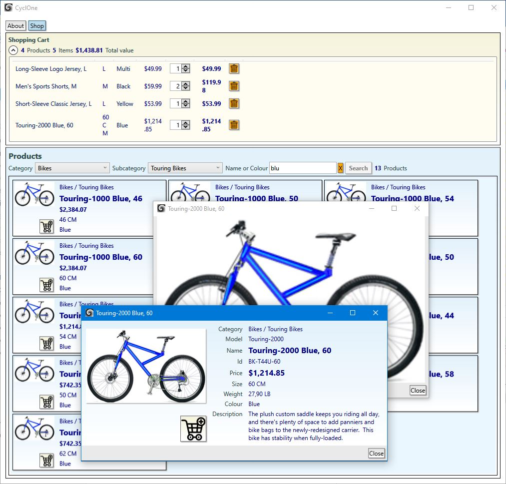

## WpfShop

#### Summary
Working desktop application for test and demo purpose based on WPF. It simulates limited shopping capabilities based on the AdventureWorks database.

#### Purpose
* Explore coding techniques based on WPF and C#.
* Explore unit and graphical tests by use of MS Unit Test, Moq and WinAppDriver.
* Explore continuous integration by using combination of Git, GitHub, and Azure DevOps.

#### Context
* This is a near equivalent of my **[PortableShop](https://github.com/a-einstein/PortableShop)**.
* Currently the application is only tested on Windows 10 version 22H2.
* Connected to Azure Devops self hosted build pipeline, including packaging, unit testing, and GUI testing. Current build status for master branch: 
* Azure DevOps release pipeline to GitHub.
* See **[Release Notes](ReleaseNotes.md)** for the latest developments.

#### Project aspects
* WPF + C#.
* MVVM.
* .Net 7 + .Net Standard 2.0.
* Prism/Unity Modules & Regions.
* Unity dependency injection.
* Client-server.
* WCF + SSL + domain + certificate.
* asynchronicity.
* Globalized resources.
* User controls.
* Attached behaviours.
* Basic styling.
* Basic exploration of unit testing by means of MS Unit Test Framework.
* GUI testing by means of WinAppDriver.
* Mocking data for testing, applying Moq.
* Transformation of configurations.
* MSIX installation.
* Click Once installation.

#### Prerequisites
* The application must be configured for a running instance of my **[AdventureWorks services](https://github.com/a-einstein/AdventureWorks)**.

#### Installation
The application is plug & play, but use of the data service is on request. Contact the developer ahead. 

Currently there are 2 installation methods, which both start with these steps.
* Download the appropriate .zip file under Assets at the **[releases page](https://github.com/a-einstein/WpfShop/releases).**
* Extract if needed.
* Continue with the method of choice below.
* If needed, start the application. Either it will start 'empty' displaying a warning, or if the data service is running, one can 'shop' the contents.
* Note that the application produces a .log file in its directory.

##### MSIX (recommended)
* If not already done, install the certificate by right clicking on the .cer file. Choose 'Local Machine' and select 'Trusted Root Certification Authorities' as store.
* Now install the application by double clicking the .msix file. If selected, the application starts right away.
* Note that the application gets installed in the Windows 'Apps' menu as *CyclOne.WPF.WAP*, and will not show up in the 'Programs and Features' list.
* Both starting and uninstallation (right click) are from the 'Apps' menu.

##### ClickOnce
* Launch setup.exe, allow it to continue if needed. Be aware of potentially hidden blockages by virus-defenders.
* The application should start up right away, but may be hidden behind other windows.
* The start menu gets a folder added: *Programs / Cyclone.WPF.ClickOnce*.
* Uninstallation can be done by: *Control Panel / Program and Features / Cyclone.WPF.ClickOnce*.
* Updating is currently not supported, but can be done manually after uninstalling.